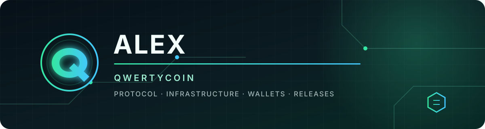

<p align="center">
  
</p>

<h1 align="center">Hi, I'm Alex 👋</h1>

<p align="center">
  <strong>Building privacy-first cryptocurrency infrastructure in the Qwertycoin ecosystem.</strong>
</p>

<p align="center">
  <a href="https://qwertycoin.org">Website</a>
  ·
  <a href="https://github.com/qwertycoin-org">Qwertycoin on GitHub</a>
  ·
  <a href="https://github.com/qwertycoin-org/qwertycoin">Core repository</a>
</p>

## What I work on

- 🧭 **Qwertycoin** — protocol engineering, infrastructure, wallets, and tooling
- 🔐 **Consensus and funds safety** — deterministic behavior, reviewable changes, and explicit failure modes
- ⚙️ **Core systems** — C++, RandomX, P2P/RPC, LMDB, Docker, Linux, and release engineering
- 🧪 **Production readiness** — reproducible builds, focused tests, threat modeling, and operational hardening

## Current focus

```text
Qwertycoin v2
├── secure, deterministic core protocol
├── reliable public node infrastructure
├── wallet and explorer interoperability
└── reproducible, verifiable releases
```

## Selected projects

| Project | Focus |
| --- | --- |
| [Qwertycoin Core](https://github.com/qwertycoin-org/qwertycoin) | Peer-to-peer protocol and reference implementation |
| [Qwertycoin GUI](https://github.com/qwertycoin-org/qwertycoin-gui) | Desktop wallet |
| [QWCX](https://github.com/qwertycoin-org/qwcx) | Cross-platform wallet |
| [Qwertycoin Website](https://github.com/qwertycoin-org/qwertycoin-org.github.io) | Public project website |

## Engineering principles

```text
simple          > clever
deterministic   > implicit
tested          > assumed
reviewable      > rushed
```

<p align="center">
  <sub>One commit a day keeps the hacker away.</sub>
</p>
